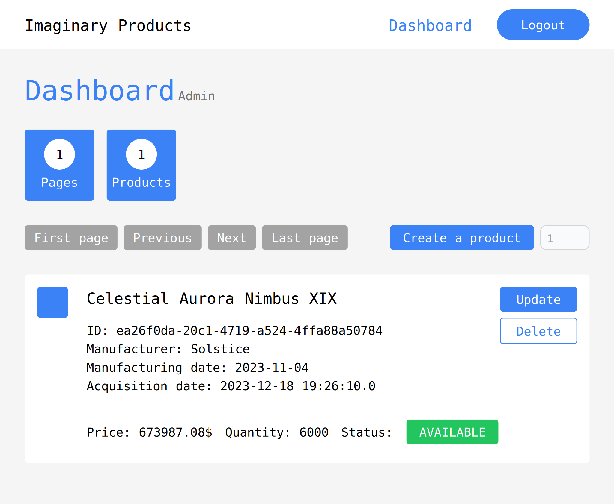

# Imaginary Products

&nbsp;



&nbsp;

A simple Spring Boot template project.

- Keywords: `Spring Boot` `MVC` `Thymeleaf` `Rest API` `Swagger UI` 
`JPA / Hibernate` `PostgreSQL` `Spring Security` `Logging` `Docker`

## Installation

**Note**, the project uses `Java 21`, and the JDK in the `Dockerfile` is set to `Amazon Corretto 21`.

### Local

Running the application locally requires an existing database + schema. To make adjustments, configure the `application.properties` file.

`application.properties`
```
spring.datasource.url=jdbc:postgresql://localhost:5432/<DATABASE>
spring.datasource.username=<USERNAME>
spring.datasource.password=<PASSWORD>

spring.jpa.properties.hibernate.default_schema=<SCHEMA>
```

### Virtual

It is possible to use `Docker` to run the application virtually. To make adjustments, configure the `Dockerfile` and `docker-compose.yaml` files.

```
docker compose -f .\docker-compose.yaml up
```

## Application

### Notes

- `Manager` and `Admin` can create a new `Product`. It uses the `ProductRandomizer` class to generate a random product. There is 
an `<input/>` next to the create `<button>`, which represents the number of randomly created products.

### REST API

A `Swagger UI` generated documentation can be accessed here: `http://localhost:8080/swagger-ui/index.html`.

A `Postman` configuration can be used. Import the file `Spring Boot - Imaginary Products.postman_collection.json`.

### Security

The credentials to login are the same, as the available roles: `EMPLOYEE`, `MANAGER` and `ADMIN`.
For example, to login as an employee:

- username: employee
- password: employee

### Authority

- `Anonymous User`: Has access to a simple list of products.
- `Employee`: Has access to detailed list of products.
- `Manager`: Is allowed to `create` and `update` products.
- `Admin`: Is allowed to `delete` a product.